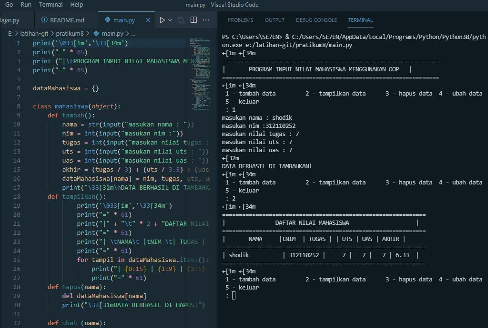

# pratikum8
1. deklarasi data mahasiswa sebagai object untuk menerima inputan 
deklarasi menggunakan class
- def tambah() di isi dengan inputan nama, nim, tugas, uas, uts dan nilai akhir
- def tampil() untuk menampilkan data yang di tambahkan 
- def hapus(nama) untuk menghapus data di dalam parameter nama
- def ubah(nama) untuk mengubah data di dalam parameter nama
2. menggunakan perulangan while true yang di isikan if elif else
3. di dalam if elif dan else masing masing memangil method yang ada di dalam class mahasiswa
4. selesai

